ParaView 5.7.0 Release Notes
============================

Major changes made since ParaView 5.6.0 are listed in this document. The full list of issues addressed by this release is available
[here](https://gitlab.kitware.com/paraview/paraview/-/milestones/10).

# General Notes

## New CMake Module System

The CMake build sub-system for ParaView has been completely redone and updated to effectively use the latest enhancements in CMake. Following these improvements, developers should see a vast improvement in CMake configure and generate times due to minimizing of the number of generated configuration files that were previously used to track module-related information. Now, all of that information is associated with the targets themselves. Furthermore, modules now respect private and
public dependencies between modules including propagation of include paths. That improves build times as it avoids leaking include paths and minimizes potential for private includes from clobbering other modules. Please be advised that these changes have resulted in changes
to available CMake options when building ParaView [Read more...](https://gitlab.kitware.com/paraview/paraview/blob/master/Documentation/dev/build.md).

Guidelines for updating ParaView plugins and ParaView-based
applications will be enumerated in a future transition guide document.

## Python 3

ParaView has had experimental support for Python 3 for several releases. In this release, we publish Python 3 compatible binaries on www.paraview.org for Windows and Linux. For macOS, we are providing binaries with Python 2 only. We expect that this will be the last ParaView release to include support for Python 2. Starting with 5.8, only Python 3 will be supported and included with the binaries. Making the transition exposed a number of lingering issues that we have addressed in this release. For example ParaView’s Cinema library had to be updated for compatibility with Python 3. Fortunately, most Python scripts generated from ParaView with Python 2 can be ported to Python 3 without much work - many may not require any porting.

## Catalyst editions not available in this release

This version of ParaView does not support the building of Catalyst editions. A Catalyst edition-like mechanism that enables selective inclusion of the parts of ParaView needed for *in situ* analysis will be added to a subsequent version of ParaView.

## Updated third-party dependencies

ParaView and VTK depend on a number of open source third-party libraries. ParaView 5.7.0 has the latest known stable versions of third-party libraries. For details and specific version numbers of third-party libraries that ParaView now depends on, please see the [list of updates in VTK](https://gitlab.kitware.com/vtk/vtk/issues/17608) and [ParaView](https://gitlab.kitware.com/paraview/paraview/issues/19045).

## Enabling rendering with Mesa

In the linux binaries, the way to use the bundled [Mesa](https://www.mesa3d.org_) libraries for rendering has changed. Instead of running `paraview --mesa-llvm`, for example, you now launch ParaView with an auxilliary executable that sets up library paths so that Mesa is used, e.g.,

```bash
> paraview-mesa paraview --backend llvmpipe
> paraview-mesa pvserver --backend llvmpipe
> paraview-mesa pvbatch --backend swr
```
Arguments to the ParaView application can be passed with

```bash
> paraview-mesa pvserver --backend llvmpipe -- --server-port=22222
```

To see all the backends available, run

```bash
> paraview-mesa --help
```

# New Features

## Plugin for Explicit Structured Grid datasets

Explicit structured grids have recently been introduced in ParaView. These grids allow definition of a dataset where cells are topologically structured (all cells are hexahedrons and structured in *i*, *j* and *k* directions) but have explicit definitions of their geometry. This dataset enables representation of geological or reservoir grids, for instance, where faults can exist in any direction.

ParaView can now render explicit structured grids. The `ExplicitStructuredGrid` plugin exposes a source and a set of filters provided to generate such grids, convert to/from Unstructured
Grids, and efficiently slice and crop those grids.

>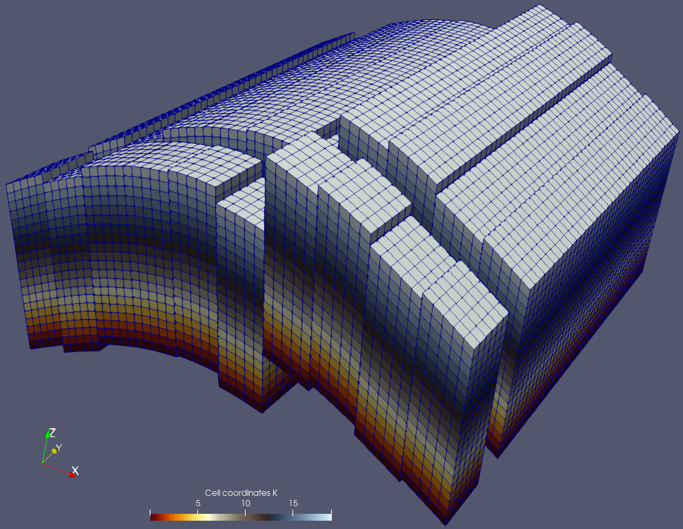
>
>*An example of an Explicit Structured Grid with faults and some masked cell layers.*

## ParaView and VTK add GPU-accelerated ray tracing with NVIDIA RTX

ParaView now includes seamless support for hardware-accelerated ray tracing using OptiX, a component of the NVIDIA RTX platform.

Accelerated by the latest-generation GPUs, especially with the RT Cores devoted to ray tracing found on NVIDIA’s Turing GPUs, ParaView brings a wide range of benefits to scientific visualization. Far beyond making pretty pictures for publication and outreach, the resulting photo-realism can in some cases be used for direct comparisons between simulation output and observations.

In other cases, the visual cues obtained by the physically based rendering process, including shadows, ambient occlusion, or even depth-of-field effects, can help to better understand the spatial relationship of the objects in the scene. This visual fidelity comes with a significant computational cost, but modern GPUs make it possible to perform this process in real time. [Read more...](https://blog.kitware.com/paraview-and-vtk-add-gpu-accelerated-ray-tracing-with-nvidia-rtx/)

>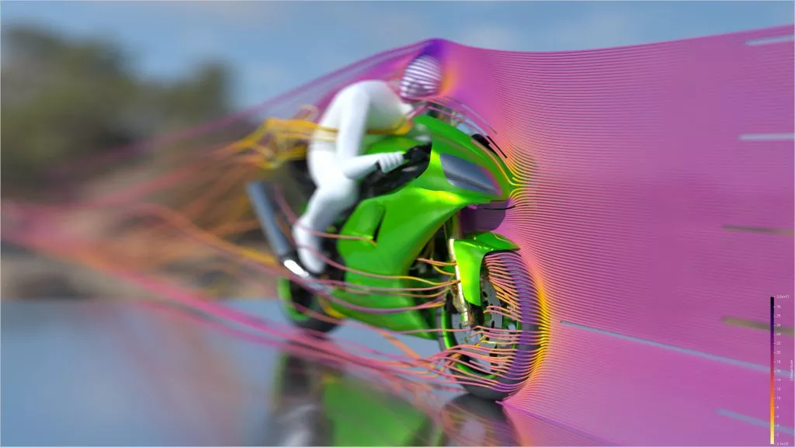
>
>*The iconic OpenFoam Motorbike, rendered with the OptiX path tracer in ParaView. Realistic materials, shadows and depth of field help to guide the viewer to the interesting part of the visualization — the turbulence around the front wheel — while providing context to convey spatial relationships.*

## New Export Inspector

The *Catalyst Export Inspector* panel has been expanded in this release and renamed *Export Inspector*. Besides exporting Catalyst scripts, it now acts as a central place to define outputs generally. That is, not only does it replace the [Temporal Parallelism Batch Script Generator plugin](https://blog.kitware.com/paraview-spatio-temporal-parallelism-revised/), but you can also now use it to set up automated screenshots, data exports and full Cinema databases within an interactive GUI session. To use it to configure the screenshots and data writers that you want in the panel, first optionally define output frequencies, then select either *Export Catalyst Script*, *Export Temporal Script* or *Export Now* items from the *Catalyst* menu. If you are in an interactive session with time varying data and choose *Export Now*, ParaView will animate through the timesteps and write out the file that you have configured. Exporting scenes to Cinema databases (`*.cdb`) through the *File* > *Export Scene...* menu option has been removed and we expect to remove more of the GUI sections and code paths that predated the unified inspector panel in the next minor ParaView release (5.8).

## Generating warning/information/error logs

ParaView now supports generating logs with varying levels of verbosity to help debug and track down performance bottlenecks.

Messages are logged at varying verbosity levels and include a timestamp from the start of the program to provide timing information. To make ParaView show log messages at all levels lower than a specific value in the range [-2, 9], use the `-v=[level]` command line option, where -2 is used for errors, -1 for warnings, 0 for info, and 9 for trace.

One can request log messages to be logged to files instead using `-l=<filename>,<verbosity>` command line option. Multiple `-l` options can be provided to generate multiple log files with different verbosities, if needed.

When logging messages, ParaView logs messages in several categories, and provides the ability to elevate the logging level for any specific category using environment variables. By elevating the level for a specific category, e.g., `PARAVIEW_LOG_RENDERING_VERBOSITY` to 0 or INFO, one can start seeing those messages on the terminal by default without having to change the `stderr` verbosity. This feature is useful for reducing the number of log messages not related to the chosen category. [Read more...](https://kitware.github.io/paraview-docs/latest/cxx/EnvironmentVariables.html).

## Exporting ParaView scenes to ParaView Glance

With our recent work on [vtk.js](https://kitware.github.io/vtk-js/index.html) and [ParaView Glance](https://kitware.github.io/paraview-glance/index.html), more exciting options for exporting data are now possible. A refreshed version of the web export feature that provides a vtkjs export of a scene from ParaView is available. In addition, this feature provides an option to embed the exported datasets into a standalone ParaView Glance HTML file. The exported vtkjs and HTML files can be sent to others for viewing and interaction using only a modern web browser. What's more, the big difference from the WebGL export is that you can use ParaView Glance to adjust the lookup tables, fields to view, representations and even create some cool looking screenshots. [Read more...](https://blog.kitware.com/exporting-paraview-scenes-to-paraview-glance/)

## Support for `vtkPartitionedDataSet` and `vtkPartitionedDataSetCollection`

The new VTK composite dataset types `vtkPartitionedDataSet` and `vtkPartitionedDataSetCollection` are now able to be read from and written to `.vtpd`/`.vtpc` files and can be rendered in ParaView.

`vtkPartitionedDataSet` and `vtkPartitionedDataSetCollection` are intended to eventually replace `vtkMultiBlockDataSet` and `vtkMultiPieceDataSet` with the goal to make it easier to develop distributed readers and filters that work with composite datasets. In coming releases, we intended to start replacing major `vtkMultiBlockDataSet` readers to start producing `vtkPartitionedDataSetCollection` instead.

# Rendering enhancements

## NVIDIA IndeX plugin updated to version 2.3:

The NVIDIA IndeX plugin for accelerated volume rendering has been updated to version 2.3.

>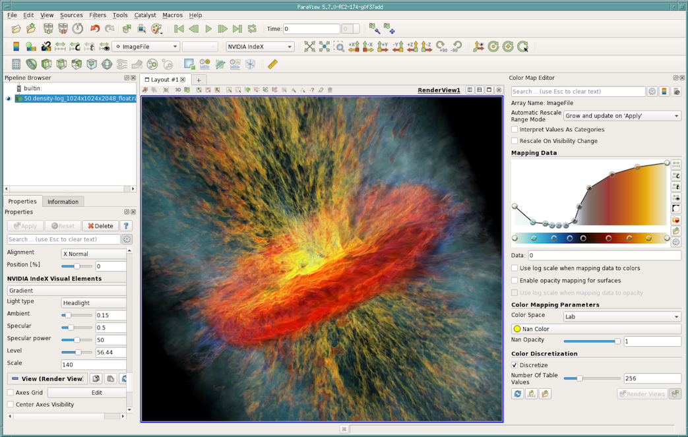
>
>*Visualization of a Galactic Wind, a simulation calculated with a GPU-Accelerated Hydrodynamic Solver (Cholla). Courtesty Prof. Brant Robertson (University of California, Santa Cruz) and Evan Schneider (Princeton University)*

### New Features

* New global instance of IndeX library is shared among all volume representations.
* Multiple volume support in scene graph (limited to one visible volume at time for current version).
* Added ParaViewWeb support.
* Added basic support for tile rendering when ParaView save screenshots/animations.
* Added support for ParaView's Scalar Opacity Unit Distance.

### Improvements

* Faster startup times for both structured and unstructured volumes meshes.
* Reduced plug-in host memory footprint.
* Logged location of performance values and scene dump outputs.
* Extended information in performance values output.
* Added warning when using datasets with scalar values in double precision.
* Added option to enable pinned staging buffer.
* Disabled rasterizer pre-allocated buffers.

### Stability fixes

* Fixed memory leaks when removing a dataset from the scene.
* Fixed issues with time-series and structured volume grids.
* Fixed crash when switching between scalar properties.
* Fixed several issues when interacting with multiple volumes in the same session.

## Ray tracing updates

ParaView 5.7 updates its version of OSPRay to 1.8.4 and includes a number of OSPRay-related fixes and improvements.  The most impactful is the incorporation of Intel's [Open Image Denoise](https://openimagedenoise.github.io) library version 0.8 which uses Machine Learning techniques to eliminate undersampled speckle artifacts from path traced images much more quickly than they would otherwise be resolved with additional sample rays and/or render passes.

>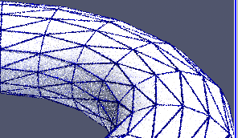
>*Path traced image with 1 sample per pixel.*
>
>
>*Path traced image with 200 samples per pixel.*
>
>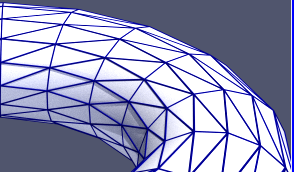
>*Path traced image with 4 samples per pixel and a denoising pass with Open Image Denoise.*

As there are now two ray tracers to choose from, the related GUI controls are now labeled "Ray Tracing" instead of "OSPRay". If your GPU supports RTX ray tracing, you will find a new ray traced backend option called "OptiX pathtracer" option in the ray traced rendering backend pulldown list.

Both OSPRay and OptiX benefit from two noteworthy new features. The first is that the ray traced render cache, which accelerates video playback, has been expanded beyond volume rendering to speed up surface rendering as well. The second was the addition of camera depth of field controls to the "Adjust Camera" dialog that let you produce images that, like in a photograph, are crisp at the focal point but blurred up to and beyond it.

>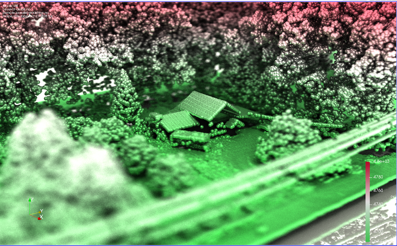
>
>*A 3D scene with camera depth of field applied.*

## Step color space

The "Step" color space option in the *Color Map Editor* enables creation of step color map functions, where the color of each interval corresponds to the color of the second point of the interval.

>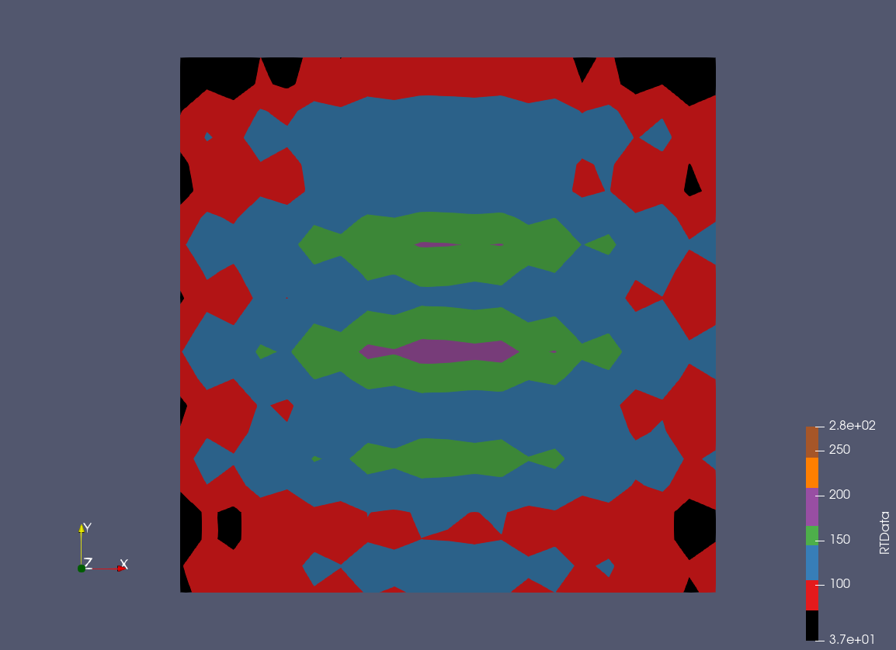
>
>*Example showing the new "Step" color space in ParaView applied to a dataset.*

ParaView comes with a few presets for the "Step" color space based on the existing indexed color maps. They are accessible through the *Choose Preset* dialog.

>
>
>*"Step" color space presets available in ParaView.*

## Default coincident topology resolution has changed

The method used to resolve coincident topology such as lines on surfaces has been changed to "Offset faces relative to lines and points". This method does not suffer from the same problems with lines appearing to float above surfaces that were present in some zoomed-in views with the previous default method "Shift z-buffer when rendering lines and points". The default offset parameters have been adjusted to be good for a wide variety of datasets bounding box sizes.

## **Logo** source

A new **Logo** source has been added. The source enables you to load an 2D RGBA image as a texture and show it projected on the foreground of the rendering plane. Its size, position and opacity can be changed interactively. This source enables you to display the logo of your institution on the images and videos generated with ParaView.

>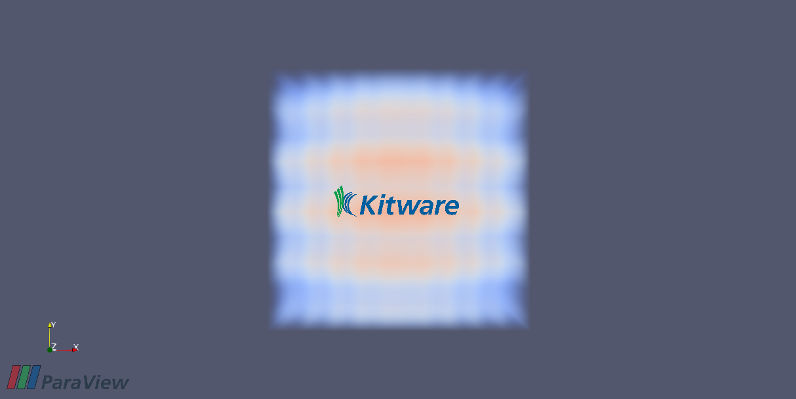
>
>*The new **Logo** source can be used to brand visualizations generated by ParaView.*

## Improvements to viewing multi-component arrays in the Spreadsheet view

The **SpreadSheet** view can now show multi-component arrays as multi-columns with a joined header. Individual component columns are still user-resizable, just like any other column.

>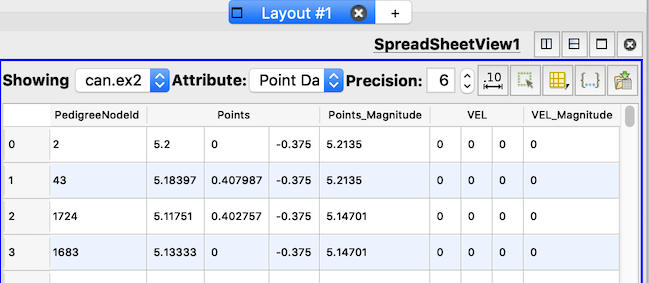
>
>*Multi-component arrays dispayed in the **SpreadSheet** view.*

## Panoramic projection plugin

Add a new plugin that enables a new render view type called the **Panoramic Projection** view. This new render view projects the current scene in order to capture the scene up to 360 degrees. Images produced from this view can be used as input for specific devices like VR headsets, domes or panoramic screens.

Two projection types are available:

* Equirectangular projection (usual world map projection)
* Azimuthal equidistant projection (fisheye projection)

>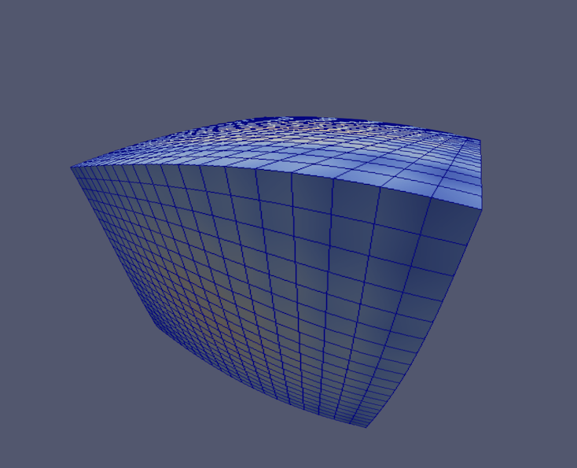
>
>*An image generated with the **Panoramic Projection** view plugin using an equirectangular projection.*

## **Point Gaussian** representation improvements

Improvements include:

* Better default configuration now managed by the domain
* Multiple corrections to the widget/dialog duality
* Bug with multiblock datasets in client/server mode has been resolved

## Better default AVI codec for Windows

The default codec for saving animation videos on Windows has been changed to I420. Furthermore, you can override the FOURCC code using the save animation dialog to choose a better codec available on your system.

## Abort animation saving

When saving animations, you can now abort the saving of animation using a popup dialog. Thus, you can cancel animations that are not progressing as expected rather than having to wait for the export to complete.

# Filter changes

## Faster contouring and slicing for datasets with only linear cells

For certain inputs, the **Contour** filter delegates operation to a filter optimized for this type of dataset. The input dataset must meet the following conditions for this filter to be used:

* All cells in the input are linear (i.e., not higher order)
* The contour array is of type `int`, `unsigned int`, `float`, or `double`
* The *Compute Scalars* option is off

In addition, if a dataset has linear cells only and the cut function requested is a plane, the **Slice** filter will delegate the slice generation to an optimized algorithm for slicing. If the *Crinkle Cut* option is enabled, a faster algorithm for linear cells is used for all cut functions.

## **Threshold** filter has new *Invert* option

The **Threshold** filter usually extracts cells that fall within lower and upper bounds of a data array. A new *Invert* option instead causes it to extract cells outside the lower and upper bounds.

## HyperTreeGrid implementation details

Work on expanding ParaView’s tree based AMR data model has continued in this release. The largest change is that VTK’s `vtkHyperTreeGrid` dataset type is no longer accepted by a majority of ParaView's `vtkDataSet` processing filters. This feature was removed because the underlying implicit conversion to `vtkUnstructuredGrid` happened too often and consumed so much memory that there was little or no benefit to using the data structure. Instead, ParaView now always stays with the memory conserving AMR representation except when you explicitly ask for a conversion via one of the two explicit type conversion filters, **HyperTreeGrid to Dual Grid**, and **HyperTreeGrid to UnstructuredGrid**.

In simple test cases memory consumption dropped with this change from 6.6 GB down to 51 MB. There were a number of other changes and improvements in this release, especially to the format of the relatively young `.htg` file formats as well. The file format changed to split up the serialized node representation into a set of grids that better support distributed memory parallelism.

## Two new uniform inverse transform sampling modes in **Glyph** filter

Two new uniform glyphing modes based on the "inverse transform sampling" algorithm were added to the **Glyph** filter to reduce sampling bias that could occur with the bounds-based uniform sampling available in previous ParaView versions. The first new mode, "Uniform Spatial Distribution (Surface Sampling)", performs uniform sampling based on surface area. In this mode, the surface is extracted first if required, so the glyphs will be located on the surface mesh only. The other new mode, "Uniform Spatial Distribution (Volume Sampling)", uses cell volume (non-3D cells are ignored) when performing the sampling.

Both modes support multiblocks and parallel meshes, as well as cell centers when using cell data.

>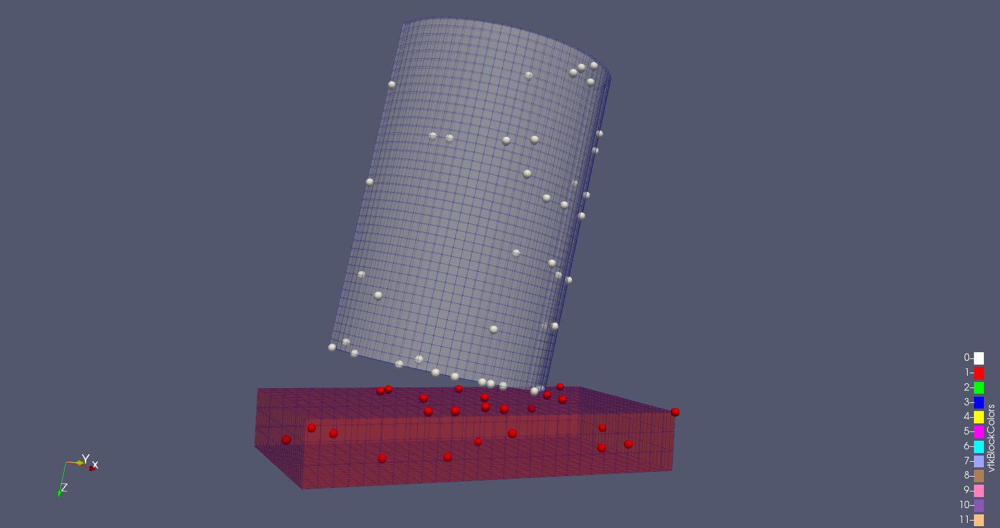
>
>*With current "Uniform Spatial Distribution" mode (now called "Uniform Spatial Distribution (Bounds Based)", the bounds are used to determine the amount of seeds. Samples are denser than they should be at the bottom of the cylindrical object, for example.*
>
>
>
>*With the new "Uniform Spatial Distribution (Surface Sampling)" mode, the seeds are distributed with uniform probability according to the surface area of the surface mesh.*
>
>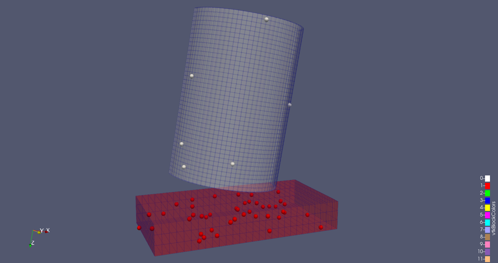
>
>*With the new "Uniform Spatial Distribution (Volume Sampling)" mode, the seeds are distributed with uniform probability according to the volume of the cells.*

## Improvements to "Box" implicit function specification

"Box" is one of the supported implicit functions for filters like **Clip** and **Slice**. The box is now specified using position, rotation, and scale parameters relative to the global coordinate space rather than the input dataset bounds. ParaView also supports specifying the box parameters relative to an arbitrary bounding box which can now be explicitly set in the UI.

>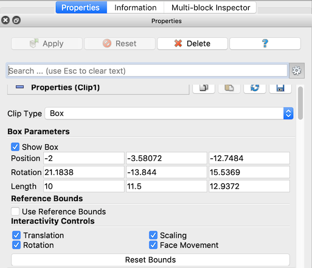
>
>*"Box" bounds are now specified in the global coordinate spacing.*

## **Append Datasets** and **Merge Blocks** allow selection of output type

The **Append Datasets** and **Merge Blocks** filters each have a new advanced property enabling the selection of the output type. If the output type is specified as a "Polygonal Mesh", then only polygonal meshes from the inputs/input blocks are merged into an output of type Polygonal Mesh. If the output type is "Unstructured Grid", then all inputs/blocks will be merged into an output of type Unstructured Grid.

## Add *Merge duplicated points* option to **Slice** filter

By default, the **Slice** filter merges points in its output. The new option makes it possible to disable point merging.

## **Connectivity** filter can sort region IDs by cell count

A new property *Region Id Assignment Mode* that can be used to order the region IDs assigned to cells and points. Supported modes are "Unspecified" where region IDs will be assigned in no particular order, "Cell Count Descending" assigns increasing region IDs to connected components with progressively smaller cell counts, and "Cell Count Ascending" assigns increasing region IDs to connected components with progressively larger cell counts. Region IDs continue to be stored in a "RegionId" array in the output of the filter.

 ## New point/cell data conversion options

The **Point Data to Cell Data** and **Cell Data to Point Data** filters now make it possible to select which arrays to convert. By default, all arrays will be converted, but if the *Process All Arrays* option is disabled, a table of arrays available for conversion will appear in the UI enabling selection of arrays to convert.

>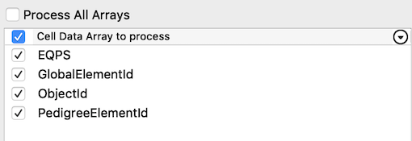
>
>*Arrays can be selected for conversion in the **Point Data to Cell Data** and **Cell Data to Point Data** filters.*

When the global *Auto Convert Properties* setting is enabled in ParaView, point and cell arrays are automatically converted when one type is required for a filter but only the other type is available. In previous versions of ParaView, all arrays were converted even though only one was needed. This was inefficient and a waste of memory. Now, only the requested arrays are converted automatically.

## Renamed sources for **Resample With Dataset**

The source names have been clarified in the **Resample With Dataset** filter.
*Input* has been renamed *Source Data Arrays* and *Source* has been renamed
*Destination Mesh*.

## Lagrangian Particle Tracker SMP implementation

The **Lagragian Particle Tracker** filter, provided in a plugin in ParaView, has been reimplemented with a multithreaded algorithm using the VTK SMP backend. These changes imply some changes on any previously developer user-developed Lagrangian Integration models as some method signatures have been modified. Please refer to the related discourse [post](https://discourse.paraview.org/t/new-multithreaded-lagrangianparticletracker/1838) for more information. For background on the **Lagrangian Particle Tracker**, please see this [blog post](https://blog.kitware.com/vtk-and-paraview-add-highly-configurable-particle-tracker/).

## **Bag Plot Matrix** View and **MultiDimensional Bag Plot**

A new property has been added to the **Extract Bag Plot** filter to allow the generation of multi-dimensional outputs. A **Bag Plot Matrix** view has been added specifically to visualize this data correctly in a **Plot Matrix** view.

## **Bag Plot** features moved to plugin

All **Bag Plot**-related features of ParaView were moved into a specific plugin called `BagPlotViewsAndFilters`. This plugin is available to load in the *Plugin Manager* in ParaView.

## NetCDF Time Annotation Filter Plugin

The new `NetCDFTimeAnnotationPlugin` exposes a filter called **NetCDF Time Annotation Filter** that can be used to easily display an annotation with the current NetCDF time of the data. This filter  benefits from a new feature of the NetCDF reader that now creates field data arrays with the time units and calendar of the produced data. The filter is a compound filter that encapsulates a **Programmable Filter** and a **Python Annotation** filter.

Important note: This plugin requires the third-party `netcdftime` Python module, which is not included in the ParaView binaries available on www.paraview.org. It is required to have it installed in order to build and use this filter.

# Readers, writers, and sources

## glTF 2.0 Reader Plugin

The `GLTFReader` plugin adds functionality for opening glTF 2.0 files, which includes:

* Reading geometry
* Changing scenes
* Enabling, disabling and playing animations
* Animation sample rate adjustments
* Enabling or disabling deformations

The plugin does not yet support materials, textures or color information.

## glTF exporter

ParaView can export scenes to the glTF 2.0 file format. It currently supports a limited subset of what ParaView can render, but polygonal meshes and optional vertex colors can be exported to glTF.

## AMReX Grid Reader

ParaView now has a raw reader for directly reading AMReX plotfiles grid data without the third-party boxlib or AMReX libraries. The reader is based on the AMReX source code for writing and reading plotfiles [AMReX code](https://amrex-codes.github.io/). This reader extends the work started for reading AMReX particle plotfiles. The reader extends the base `vtkAMRBaseReader`, which, in turn, extends `vtkOverlappingAMRAlgorithm` producing a `vtkOverlappingAMR` set of `vtkUniformGrids`. The reader allows for the processing of a time series of AMReX data sets. The selection of the visible AMR layers and fields is made available through the ParaView graphic user interface (GUI) similar to other readers that extend `vtkAMRBaseReader`.

>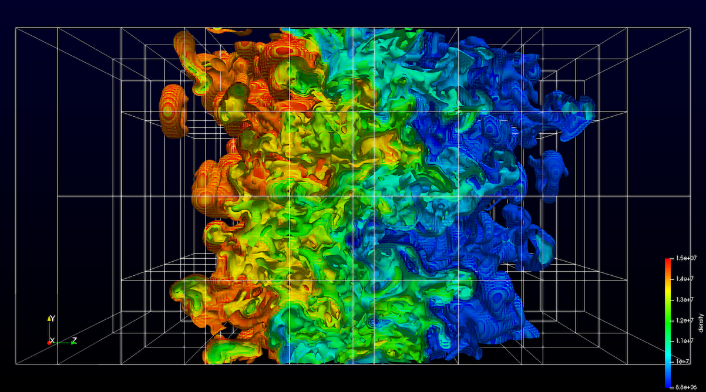
>
>*Rayleigh-Taylor instability with heavy fluid on top of light fluid with gravity. Data produced by the [IAMR example code](https://github.com/AMReX-Codes/IAMR/tree/master/Exec/run3d) and stored in an AMReX plotfile that can now be read into ParaView.*

## `GmshReader` plugin

The XML interface file (`.mshi`) for the `GmshReader` plugin has been simplified and made more flexible. The documentation has been updated accordingly in `Plugins/GmshReader/README.md` in the ParaView source directory, along with the test data.

The Gmsh API has changed since Gmsh 4.1.0 so that another variant of the msh 2 format named "SeparateViews", which is better suited for massively parallel simulations, can be handled by the plugin, along with the traditional "SingleFile" and "SeparateFiles" variants of the msh 2 format.

The minimum Gmsh version required by the plugin has been changed to 4.1.0.

## **ExodusII** reader performance improvement

A bug that could dramatically slow reading of Exodus II file series in ParaView 5.6.0 was fixed.

## SEP Reader

A reader for [Stanford Exploration Project (SEP)](http://sep.stanford.edu/doku.php) files is now included in ParaView.

## ParFlow reader

* ParaView can now read ParFlow's simulation output (files named `.pfb` and `.C.pfb`).

* Preliminary support for reading multiple ParFlow files onto a single pair of meshes (surface and  subsurface) is also provided; it expects JSON files with a `.pfmetadata` extension.

+ Example Python filters are included to calculate:
    * Total subsurface storage
    * Water table depth at every surface point
    * Total water balance (including subsurface storage, surface storage, and surface runoff).

## CGNS reader changes

The CGNS reader has a new capability to store a mesh on user demand (*Caching Mesh Points* button) that allows faster loading of unsteady solutions when animating flows and makes it smoother to load/unload variables while doing interactive analysis.

In addition, a crash that occurred when CGNS files were reloaded has been fixed.

## Upgrade of ICON/CDI netCDF reader

The CDI reader has been updated to read ICON netCDF files from users of the ICON model used in climate science.

## Parallel EnSight Gold reader handles larger files

The Parallel EnSight Gold reader has been updated to support loading EnSight Gold files with up to the maximum number of points and cells supported by the file format.

## Improve CSV, TSV and TXT output from parallel server runs

Improving the comma-separated value (`.csv`), tab-separated value (`.tsv`) and text (`.txt`) output to work better in parallel using a pass-the-baton parallel approach that has all processes take turns passing their data to process 0 for writing to disk. Additionally, composite datasets are now written out into a single file instead of a file per block.

## Parallel XML writers are now available in serial

The parallel XML writers are now available for saving data in the GUI as well as via the Python `SaveData()` method when the server is run with a single process. This enables you to record Python traces in serial and then run the resulting Python script later on in parallel.

## Improvements to several non-parallel writers (STL, PLY, VTK, and others)

Writers for file formats such as STL, PLY, legacy VTK, which do not support parallel writing, historically reduced all data to the root node when running in parallel, then wrote the data out on that node alone. To better support large data use-cases, you can now choose a subset of ranks to reduce the data to and write files from. Using contiguous or round-robin grouping on ranks, this mechanism enables use-cases where multiple MPI ranks are executing on the same node and you want to nominate one rank per node to do the IO.

>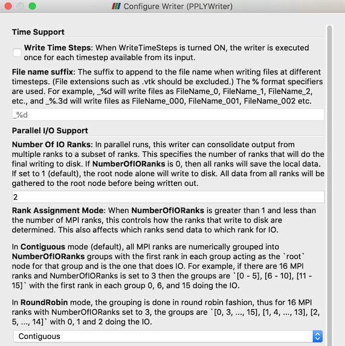
>
>*New parallel I/O writing options for non-parallel dataset types.*

# Interface improvements

## New button in view toolbar to save view content to clipboard or file.

A new *Screenshot* button is added to the right of the Undo/Redo buttons. It can also be accessed through the new *Copy Screenshot to Clipboard* item in the *Edit* menu.

>
>
>*The new toolbutton to save a screenshot to the system clipboard.*

When clicked without pressing a keyboard modifier (Ctrl, Alt or Shift), the capture is performed to the clipboard. Otherwise, the button/menu acts as a shortcut to *File* > *Save Screenshot* (to a file). Note that this feature is available only for render and chart views.

## New scalarbar auto-update option

Add an option to auto update the scalar bar range to be the same as the array range of the data when the *Apply* button is pressed. Previously existing options allowed the range to only grow when the *Apply* button was pressed.

## Changes to zoom-to-box

Zoom-to-box now defaults to anchoring the corner points of the box at the point where the interaction starts. You can switch to centering the box at the interaction start point instead (the default in ParaView versions prior to 5.7) by using the Control or Shift keys.

## Plugin descriptions

The *Plugin Manager* dialog now shows plugin descriptions. The description for a plugin is shown only after a plugin is loaded.

>
>
>*Plugin descriptions appear in the Plugin Manager.*

## New setting for default Render View interaction mode

A new ParaView setting has been added to render views for the 2D/3D interaction mode to use when loading a new dataset. The default behavior, called "Automatic", works the same as in previous versions of ParaView, in which the interaction mode is set to 2D or 3D based on the geometric bounds of the dataset. New options are now available to override this, and alternatively specify "Always 2D" or "Always 3D".

## Simpler SSH configuration

Instead of relying on a complex `.pvsc` file, it is now possible to use the following XML elements to configure client/server connections through SSH:

* `<SSHCommand exec=...>` instead of `<Command exec=...>` so the command will be executed through SSH
* `<SSHConfig user="user">`, child of `<SSHCommand>` with an optional argument to set the SSH user
* `<Terminal exec=/path/to/term/>`, child of `<SSHConfig>` with an optional terminal executable argument. When this tag is set, the SSH command will be executed through on a new terminal
* `<SSH exec=/path/to/ssh/>`, child of `<SSHConfig>` with an `ssh` executable argument. When this tag is set and the executable is specified, a specific `ssh` executable will be used
* `<Askpass/>`, child of `<SSHConfig>`, so an `askpass` program is used. Make sure to set `SSH_ASKPASS` and `DISPLAY` before using this. Incompatible with `<Terminal>` tag, only available on Linux.
* `<PortForwarding local="port">`, child of `<SSHConfig>` with an optional local port argument, this is the biggest change. This allow to set up port forwarding through SSH tunneling. If no local port is defined, the server port will be used.

When `PortForwarding` is used, it is completely invisible to the user, the remote host and port are correct and not related to the SSH tunneling. In order to inform the user that the communication between client and server is secured, the server icon in the pipeline browser is augmented with a padlock.

>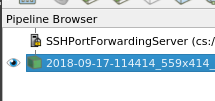
>
>*Server connections secured with SSH are shown with a lock on the icon.*

Example of a simple configuration file:
```XML
<Servers>
  <Server name="SimpleSshServer" configuration="" resource="cs://127.0.0.1:11111">
    <CommandStartup>
      <SSHCommand exec="/home/login/pv/startpvserver.sh" timeout="0" delay="5">
        <SSHConfig user="login">
          <Terminal/>
        </SSHConfig>
        <Arguments>
          <Argument value="$PV_SERVER_PORT$"/>
        </Arguments>
      </SSHCommand>
    </CommandStartup>
  </Server>
</Servers>
```

Also, the new environment variable `PV_SSH_PF_SERVER_PORT` should be set when performing reverse connection with  port forwarding.

In order to be able to use it you need:

 * On Linux: any terminal emulator, `ssh` (default on most distributions) and `ssh_askpass` if needed
 * On Windows: Preferably an installed Putty (`plink`), alternatively, Windows 10 spring update SSH client, and `cmd.exe` (default)
 * On MacOS: `Terminal.app` and `ssh` (both default)

 For more information on how to use this new configuration file schema, see [this post on the ParaView Discourse forum](https://discourse.paraview.org/t/using-ssh-support-to-secure-your-client-server-communication-with-paraview/682).

## Consistent time selection controls

The time selection controls are now consistent between the *Current Time Controls* toolbar and *Animation View*.

# Python scripting improvements

## Python Trace window scrolls to the bottom when tracing

When a Python Trace is active and the option to update the **Show Incremental Trace** option is enabled, the window showing the trace will scroll to the bottom as new trace code is added.

## Layouts and Python support

Mutliple views and layouts are now better traced in Python. When the generated trace is played back in the GUI, the views are laid out as expected. Also, Python state can now capture the view layout state faithfully.

Developers and Python users must note that view creation APIs no longer automatically assign views to a layout. One must use explicit function calls to assign a view to a layout after creation.

## OpenGL information retrieval in `paraview.simple` module

A new function, `GetOpenGLInformation()`, has been added to the `paraview.simple` module. It enables recovery of OpenGL related information, like GPU vendor, OpenGL version, and capabilities.

It can be used as follows

```python
openGLInfo = GetOpenGLInformation()
openGLInfo.GetVendor()
openGLInfo.GetVersion()
openGLInfo.GetRenderer()
openGLInfo.GetCapabilities()

openGLInfo = GetOpenGLInformation(servermanager.vtkSMSession.RENDER_SERVER)
openGLInfo.GetVendor()
openGLInfo.GetVersion()
openGLInfo.GetRenderer()
openGLInfo.GetCapabilities()
```

## Tracing of animation controls and camera links

Changes to time and animation controls are now recorded in Python traces. Additionally, the setup of camera links is recorded.

# Molecular data enhancements

## Improvements to Graph and Molecules support

ParaView provides the following features that augment Graph and Molecule data support:

 * Panel information shows values for graphs and molecules
 * The **Calculator** filter supports graphs and molecules as input
 * The Molecule representation now supports the *Map Scalars* display property. As is the case with other datasets, this property disables color mapping when on and uses direct RGB values from a the color array as long as it contains 3-components.

## **Molecule** representation updates

Additional molecule mapper properties, such as atom/bond size and color, are now available in the molecule representation.

Presets that control the new molecule mapper properties have been added, and are available from the GUI and from Python.

# Miscellaneous bug fixes

## Opacity function editor

A bug in the opacity function editor widget that occurred when the range was changing from a high minimum to a low maximum value resulting in the opacity editor becoming white has been fixed.

## Color transfer function editor bug when log scaling is on

The color transfer function editor widget could get in a bad state when log scaling was enabled. This bug has been fixed.

## **Slice** view interactive point selection and hover over points fixed

In the **Slice** view, interactive point selection and hover over points features were buggy. That problem has been solved in this release.

## Freeze selection fix

A bug that occurred when freezing selections on composite datasets has been fixed.

## Context menu on HiDPI displays

When right-clicking on render views, the incorrect data object could be selected on HiDPI displays. This issue has been fixed.

## **Cell Centers** bug with `vtkEmptyCells` fixed

The **Cell Centers** filter had incorrect behavior with `vtkEmptyCell`s. The filter used to replace empty cells by uninitialized points and did not copy cell data to point data for such cases. Now, ParaView makes sure that th **Cell Centers** filter does not create points; for empty cells and ensure that point data are correctly mapped to input cell data.

## **Random Attributes** filter produces additional array type

**Random Attributes** can now generate attributes of type `vtkIdType`.

# Developer notes

## pvconfig-cleanup

* The `vtkPVConfig.h` header no longer provides feature details like whether
  MPI, Python, or various VisIt readers are enabled. Instead, CMake logic
  should be used to detect whether the metafeatures are enabled (VisIt readers
  are not exposed currently).

## Quad-buffer stereo (Crystal Eyes active shutter glasses) on Linux and Windows

ParaView once again supports quad-buffer stereo for Linux and Windows. This functionality was lost during migration to Qt 5. With this release, ParaView uses a `QOpenGLWindow`-based rendering widget to support quad buffer stereo on Linux and Windows provided it is supported by your graphics card, drivers and window-manager. Quad buffer stereo is not supported on macOS.

## Improvements to parallel rendering support

This release includes changes to the parallel rendering code to simplify the logic for developers and maintainers along with addressing some long standing issues with tile displays and CAVE rendering, especially when dealing with split views.

Developers developing new view types should note that the view API has been simplified considerably. Earlier views needed to handle the case where all views could be sharing the same render window on server processes. That is no longer the case. Each view now gets a complete render window and has control over the renderers added to that window. Server processes still have a share rendering window which is used to display the combined results from multiple views to the user via `vtkPVProcessWindow`, but `vtkPVView` subclasses don't have to handle it. `vtkViewLayout` manages all the collecting of rendering results from each view and posting them to a user viewable window, if and when needed.

In CAVE mode, we now handle split views more consistently by ensuring only one of the views is presented in the CAVE. Currently, it's the most recently rendered view.

Additionally, more logging entries were added that are logged under the `PARAVIEW_LOG_RENDERING_VERBOSITY` category that should diagnose parallel rendering issues.

## Main window event handling has moved to behavior classes

ParaView and ParaView-derived applications have their own main window class that inherits from `QMainWindow`. The standard Qt approach to intercepting signals from the main window (e.g. "close application") is to reimplement `QMainWindow`'s event methods (e.g. `closeEvent(QCloseEvent*)`). This polymorphic solution is not available to ParaView-derived applications comprised of
plugins, however. To facilitate a plugin's ability to influence the behavior of ParaView's main window, ParaView now has `pqMainWindowEventManager`, a manager that emits signals when the main window receives events. These signals are connected to `pqMainWindowEventBehavior`, a behavior class for performing tasks originally executed in ParaViewMainWindow (with the exception
of the splash screen).

## Showing `information_only` properties in the *Properties Panel*

Previously, it was not possible to show a widget for an `information_only` property. It is now possible by declaring the `panel_visibility` attribute in the declaration of the property. By default, and contrary to non-information-only properties, the default value (when not specified) is `never` (instead of `default` for standard properties). Note that when the widget is shown, it will always be disabled (i.e., not editable) because it is read-only.

Here is a simple example showing how to expose an `information_only`property in the GUI:
```
    <DoubleVectorProperty command="GetShrinkFactor"
                       information_only="1"
                       panel_visibility="default"
                       name="ShrinkFactorInformation">
    </DoubleVectorProperty>
```

## `PipelineIcon` filter hint in server manager XML

XML filter definitions can now specify the pipeline icon to use for a specific filter or output port.
The icon can be either a view type name or an existing icon resource.

```
 <SourceProxy>
   <Hints>
     <PipelineIcon name="<view name or icon resource>" port="<output port number>" />
   </Hints>
 </SourceProxy>
```

>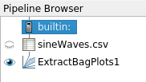
>
>*The **Extract Bag Plots** filter uses a custom icon in the Pipeline Browser.*

## Moving away from named domains

The name of domains in XML properties used to have an impact on how this property will be shown in the UI. This was quite error prone. We have now completely moved away from named domains. The name of the domain in the XML property does not matter, with the notable exeception of:

* `InputArrayDomain` name still matters as it can then be used in an `ArrayListDomain`.
* `glyph_scale_factor` panel widget still requires the usage of two domains named `scalar_range` and `vector_range`. This is error prone and will be corrected in the future with a domain dedicated to it.

## XML properties inherited from base proxy can be overridden

`override` is a keyword that previously allowed replacement of properties from
a base proxy in an inherited proxy. Improvement to this mechanism comes in two forms:

* It supports any type of property
* The base proxy property is actually replaced instead of removing/adding it, hence it appears at the same location in the UI.

## **SpreadSheet** view

The ability to subclass of the **SpreadSheet** view in ParaView-based applications has been improved.

# Catalyst

## Spatio-temporal batch parallel capability promoted

ParaView's spatio-temporal batch parallel capability has been promoted from a non-default plugin  to a core feature that comes with every Python-enabled ParaView build. [Read more...](https://blog.kitware.com/paraview-spatio-temporal-parallelism-revised/)
