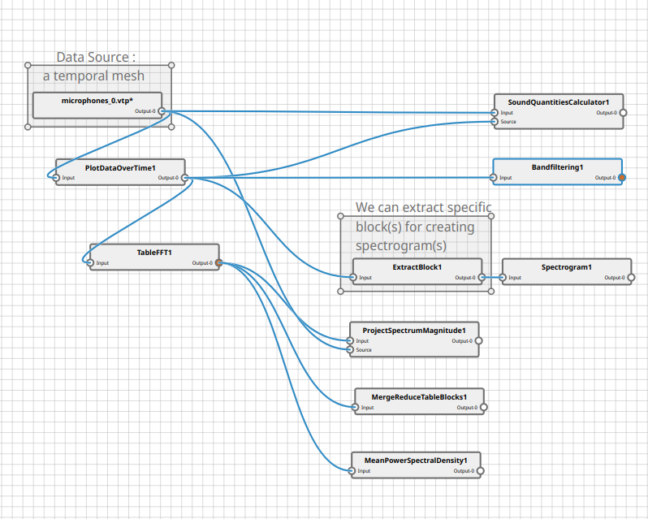
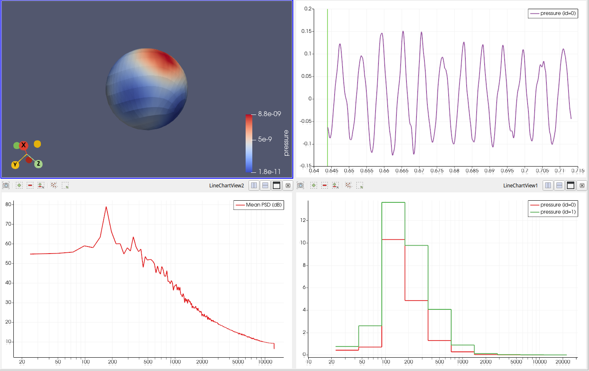

# Digital Signal Processing for Paraview

This plugin aims to bring basic digital signal processing and audio preview to ParaView.
It offers a few new filters and a new dock panel.

## General ideas and usage

VTK pipeline and data model do not offer a very efficient way of accessing and processing temporal data on a mesh.
This is why most of the filters works on a multi-block dataset of several tables. The idea is that for a given mesh
with `n` points and `t` timesteps we create a multi-block with `n` tables inside, and each of these tables contains
`t` rows. A column of a table represents a point attribute of the input mesh. It is possible to create such a
structure in ParaView using the `Plot Data Over Time` filter on a temporal dataset, with the option
`Only Report Selection Statistics` turned off.

**DISCLAIMER** : The current implementation of the filters in this plugin, as described above, does not
work in with multiple processes. That also means that these filters do not scale well for very large datasets.
Please use the `Extract Selection` and `Extract Timesteps` filters in order to reduce the range of your
study when needed, and only use a single `pvserver` MPI process. A rework of the architecture is needed in order
to improve the scalability of these filters.

## New filters

### Mean Power Spectral Density

This filter computes the mean power spectral density (PSD) of temporal signals.
The input should be a multiblock dataset of vtkTables where each block
represents a point. Each row of the tables corresponds to a timestep.

### Sound Quantities Calculator

Compute the pressure RMS value (Pa and dB) as well as the acoustic power from a sound pressure (Pa) array.
Could be improved by adding more conversions.

This filter has 2 inputs:
- port 0 is the input geometry for cell connectivity.
- port 1 is a multi-block dataset representing the data through time. Block flat index
corresponds to the index of the point in the input mesh. This kind of dataset
can be obtained e.g. by first applying the filter Plot Data Over Time with the
option "Only Report Selection Statistics" turned off.

The output is the input geometry with the computed sound quantities attached to
it i.e. the mean pressure, the RMS pressure and the acoustic power.

### Spectrogram

This filter computes the spectrogram of the input vtkTable column.
The output is a vtkImageData where the X and Y axes correspond to time and
frequency, respectively.
The spectrogram is computed by applying a FFT on temporal windows each containing
a subset of the input samples. The window size and type can be controlled with the
time resolution and window type properties, respectively.

### Project Spectrum Magnitude

This filter computes the magnitudes of a column from a multi block
of tables (input) and places them on the points of a given mesh (source) for
a specified frequency range.

### Merge Reduce Table Blocks

This filter performs reduction operations such as the mean or the sum over columns
across all blocks of a multiblock of vtkTables.

## Audio Player Panel

The pqAudioPlayer dock widget allows to read audio retrieved from the current active source.
It will output audio to the default system audio sink. Please be carefull with your hears and
lower the volume and raise it gradually, especially if you are using earphones.

The active source has to produce a vtkTable, containing the audio signal. Each column of the vtkTable
is interpreted as a different audio signal and can be selected in the widget. Each row represent
a sample. The sample rate is selected manually in the widget. The default value can be
automatically configured by adding a field data array in the vtkTable named "sample_rate".

## Example

Here's an example of a pipeline that uses all of the filters exposed by this plugin, presented using
the node editor :

And a part of the resulting output :

## Acknowledgement

This work is funded by the CALM-AA European project (cofunded by the European fund for
regional development)

